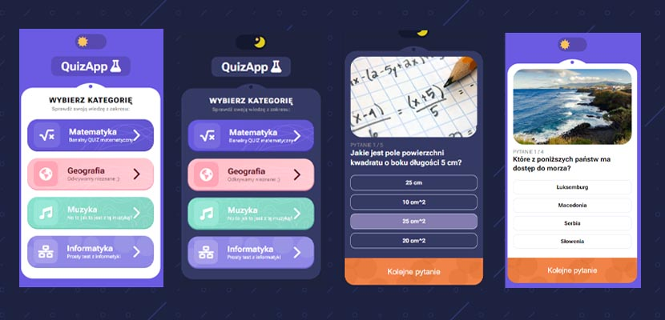

<a id="readme-top"></a>

<br />
<div align="center">
    

<h2 align="center">QUIZ APP</h2>
<p>I present a simple quiz app. Application made in Vanilla JS technology.</p>
<p> At the moment there are 4 categories to choose from, but you can easily add new ones. 
You can choose day or night mode.</p>
<p>Good luck ;)</p>

  <p align="center">
    <a href="https://quiz-app-practice.netlify.app/">View Demo</a> · <a href="https://github.com/AndrzejPuczko/quizApp/issues">Report Bug</a>
  </p>
</div>





<p align="right">(<a href="#readme-top">back to top</a>)</p>

### Installation
If you really want to edit this app just:

1. Clone the repo
   ```sh
   git clone https://github.com/AndrzejPuczko/quizApp.git
   ```
2. Install NPM packages
   ```sh
   npm install
   ```
3. Run the development server
   ```sh
   npm run dev
   ```

<p align="right">(<a href="#readme-top">back to top</a>)</p>

## Contact

Andrzej Puczko - [puczko.andrzej@gmail.com](mailto:puczko.andrzej@gmail.com)

Project Link: [https://quiz-app-practice.netlify.app](https://quiz-app-practice.netlify.app/)

<p align="right">(<a href="#readme-top">back to top</a>)</p>